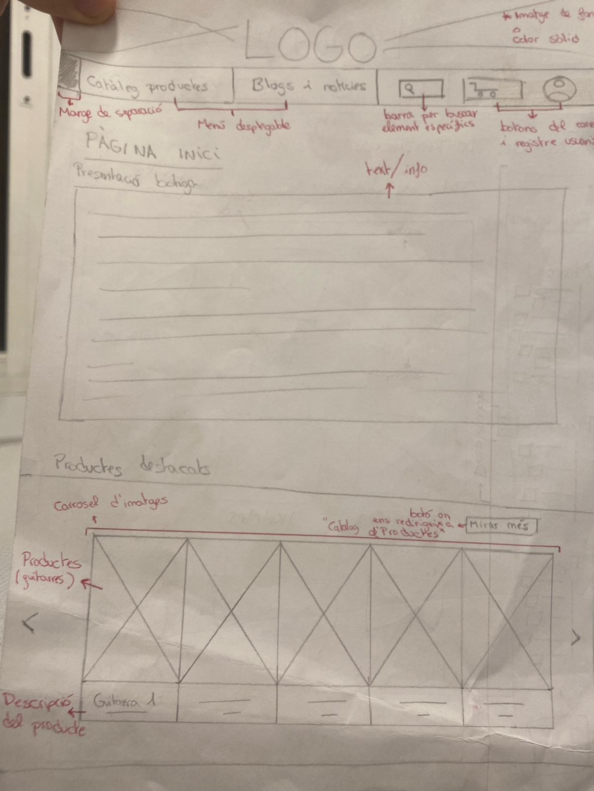
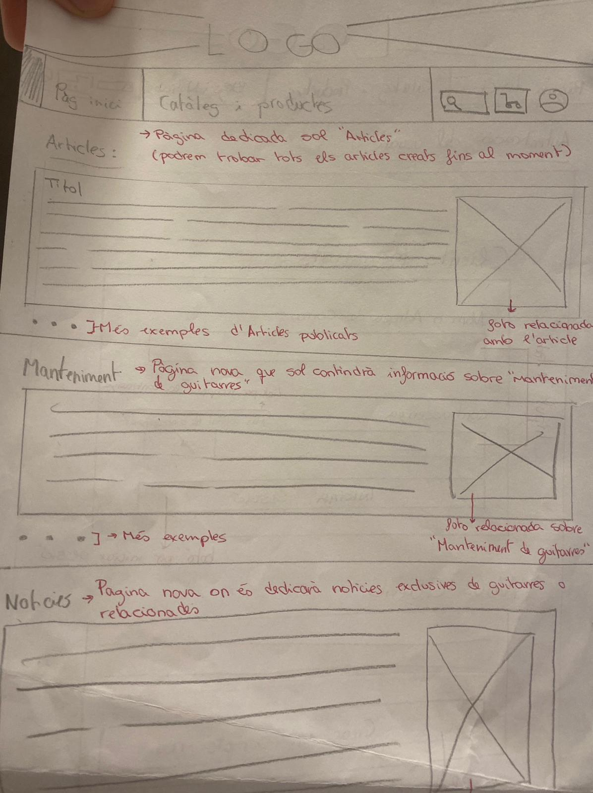
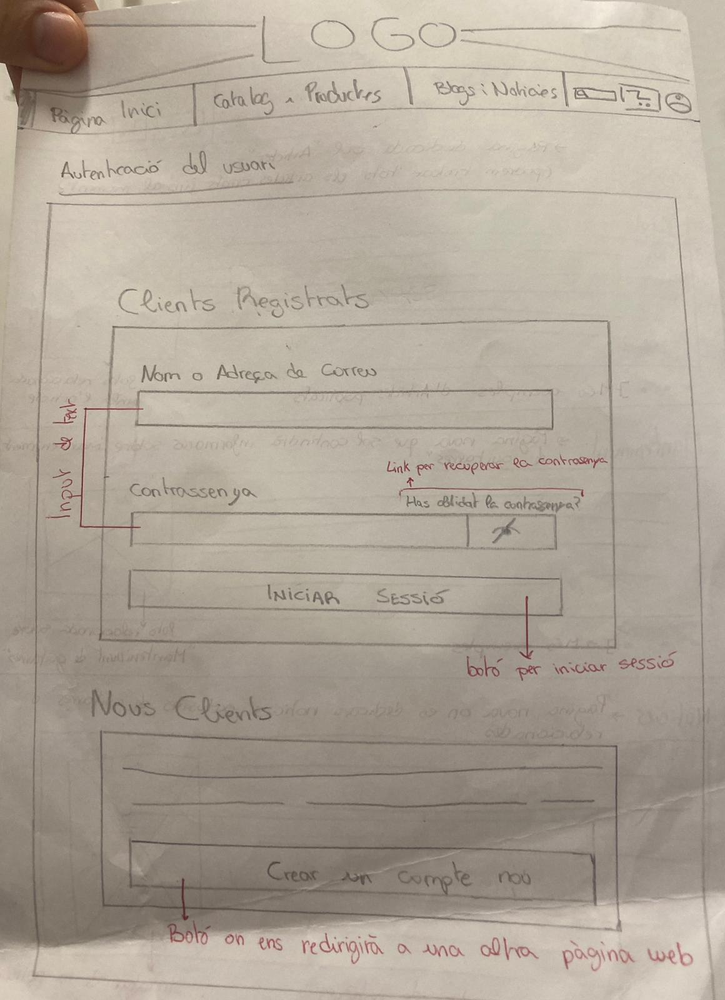
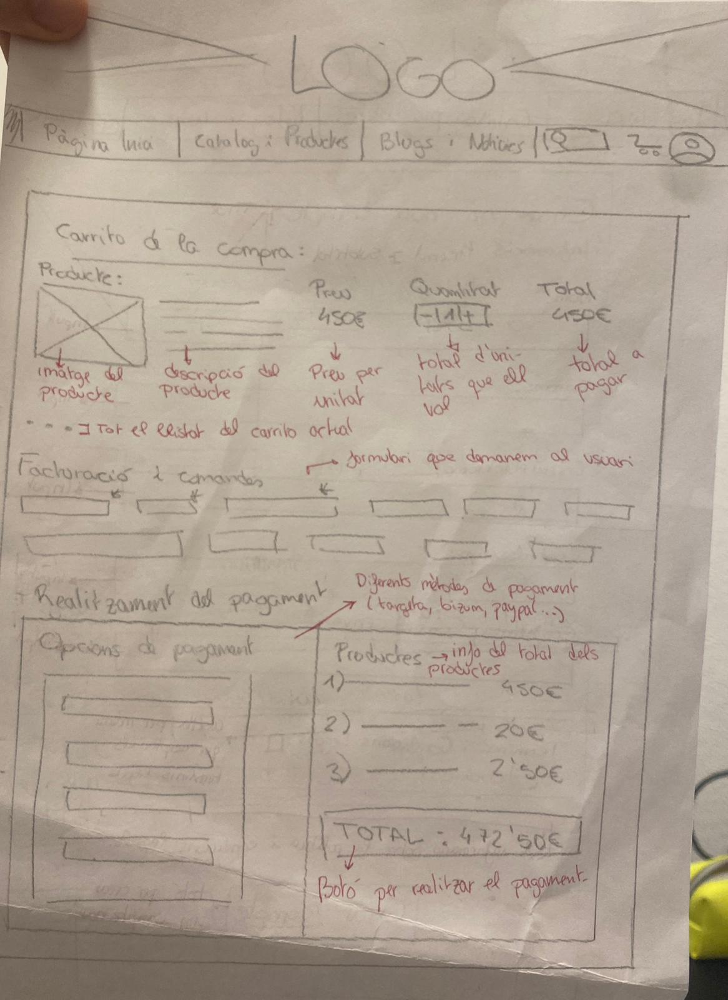

# P0_wireframe
## Fet per: Albert Penadés i Karolayn Munoz
## 22/10/24

## APARTAT DE DAW - BRANCA ALBERT PENADÉS CASAJÚS

### Podem veure que la pàgina principal per:
#### 1- Capçalera amb el logo de l'empresa. Si ens hi fixem disponem d'un menú amb els diferents sub-apartats de la web. Aquest menú disposa d'unes icones perquè el nostre usuari pugui interactuar amb elles, aquestes són: la lupa, carret de la compra i el perfil de l'usuari. Aquest mmenú serà fixe per a tots els apartats de la web.

#### 2- Un text just al centre de la pantalla, on possiblement més endavant afegim alguna fotografia relacionada amb el que expliquem. Aquest text donarà una petita introducció sobre qui som i de que fem.

#### Més avall trobem un carrusel d'imatges amb productes més destacats. Tindran una petita descripció que aportarà informació necessaria. Just al costat hi hà un link o botó que redirigirà els nostres usuaris a la secció de tots els productes.

### Aquesta secció mostra tot tipus de guitarres que tenim.
#### Aquestes les podem filtrar per: -> Marca, preu i tipus. Més avall he implementat el logo de l'empresa de guitarres per omplir el vuit.

### Sub-pàgina del catalog de productes
#### 1- Un cop el nostre usuari hagi clicat el tipus de guitarra que més li cridi l'atenció o per el motiu que sigui, es trobarà en aquesta nova pagina.

#### Sol veurem guitarres del tipus que l'usuari hagi decidit veure. Hi hauràn imatges, el nom, una petita descripció i el preu.

#### En l'apartat de sota he resumit la secció de quan l'usuari ja s'ha decidit per escollir una guitarra o ja sigui per veure les especificacions de la guitarra, o per comprar-la. Tindrà una descripció completa, amb el seu nom, varies imatges, les resenyes i el preu. A l'hora de comprar-lo pot decidir en afegir-lo al carret de la compra per seguir comprant.

### Apartat dedicat sol als nostres blogs i notícies.

#### Hi han tres columnes on sol es podrà visualitzar 1 article, 1 altre de manteniment i 1 notícia. Aquests volem que siguin els més destacats de cada secció. Si l'usuari li entra la curiositat podrà donar-li al botó de sota (veure més) de cada secció per poder llegir tots els blogs/notícies que hagim afegit fins al moment.

### Sub-apartat de blogs/notícies al que hagi fet click.
#### Aquí l'usuati podrà documentar-se de tot el que necessiti, hi haurà blogs resumits amb imatges que vagin relacionades.

### Iniciar sessió o crear un nou compte.
#### Serà un formulari per què el nostre usuari pugui iniciar sessió en la nostre web. També disposa d'un sub-apartat per crear-se una nova compte.

### Crear un nou compte.
#### L'usuari al donar-li el botó de "Crear nou compte" el dirigirem aquest apartat per què es pugui crear un npu compte i poder aprofitar més de les nostres funcions.
#### Ha de completar tots els camps per què més endavant nosaltres recopilarem aquelles dades.

### Carrito de la compra.
#### Secció específica per realitzar els pagaments de l'usuari. Mostrarem per pantalla els detalls dels prodcutes per columnes: imatge referent al producte, nom del producte, preu, quantitat, i el subtotal. Podrà eliminar els productes que ell vol o afegir tants com vulgui. Els '...' em refereixo a si ha afegit més productes. 

#### Secció de facturació i comandes: Formulari on ha de completar amb informació personal: Nom i cognom, correu, carrer, codi postal...

#### Realitzar pagament: Tindrem varies opcions per què puguin comprar (paypal, mastercard, bizum...) I un cop seleccionada tota la informació anterior realitzarem la compra fent click al botó on posa "Total: _€"